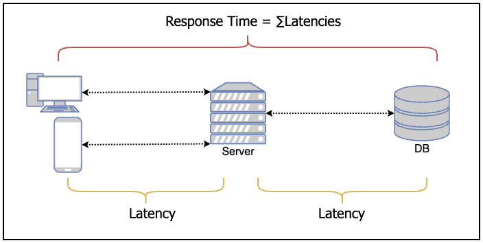

# Annotations

#### Design Data-Intensive Applications - Chapter 1:
- **Reliability:** The system should continue to work correctly (performing the correct function at the desired level of performance) even in the face of adversity (hardware or software faults and even human error).

- **Scalability:** As the system grows (in data volume, traffic volume or complexity) there should be reasonable ways of dealing with that growth.

- **Maintainability:** Over time, many different people will work on the system (Engineering and Operations, both maintaining current behavior and adapting the system to new use cases) and they should all be able to work on it productively.
  - **Operability:** Make it easy for operations teams to keep the system running smoothly.
  - **Simplicity:** Make it easy for new engineers to understand the system, by removing as much complexity as possible from the system.
  - **Evolvability:** Make it easy for engineers to make changes to the system in the future, adapting it for unanticipated use cases as requirements change. Also known as extensibility, modifiability or plasticity.

- **Latency and Response Time:** Are often used synonymously, but they are not the same. The Response Time is what the client sees besides the actual time to process the request (the service time), it includes network delays and queueing delays. Latency is the duration that a request is waiting to be handled,during which it is latent, awaiting service.

- **Describing Performance**
  - When you increase a load parameter and keep the system resources (CPU, memory, network bandwidth, etc.) unchanged, how is the perfomance of your system affected?
  - When you increase a load paramter, how much do you need to increase the recources if you want to keep performance unchanged? 
  - In an ideal world, the running time of a batch job is the size of the dataset divided by the throughput. In practice, the running time is often longer, due to skew (data not being spread evenly across worker processes) and needing to wait for the slowest task to complete.

#### Design Data-Intensive Applications - Chapter 3:
- **OLTP (Transaction Processing):** Systems are typically user-facing, which means that they may see a huge volume of requests. In order to handle the load, applications usually only touch a small number of records in each query. The applications requests record using some king of key and the storage engines uses an index to find the data for the requested key. Disk seek is often the bottleneck here.
  - We saw storage engines from two main school of thought:
    - The log-structured school which only permits appending to files and deleting obsoletes files, but never updates a file that has been written. Bit Cask, SStables, LSM-Trees, LevelDB, Cassandra, HBase, Lucene and others belong to this group.
    - The update-in-place school, which treats the disk as a set of fixed-size pages that can be overwritten. B-trees are the biggest example of this philosophy being used in all major relational databases and also many non-relational ones.
- **OLAP (Analytical Processing):** Data warehouses and similar analytics systems are less well known, because they are primarily used by businees analysts, not by end users. They handle a much lower volume of queries than OLTP systems, but each query is typically very demanding, requiring many millions of records to be scanned in a short time. Disk bandwidth (not seek time) is often the bottleneck here and column oriented storage is an increasingly popular solution for this kind of workload.

#### Software Architecture (The Hard Parts) - Chapter 1:
"Data is a precious thing and will last longer than the systems themselves." - Tim Berners-Lee

- **Operational Data (OLTP):** Data used for the operation of the business, including sales, transactional data, inventory and so on. This data is what the company runs on. Involving: Inserting, Updating and Deleting data in a database.
- **Analytical Data (OLAP):** Data used by data scientists and other business analysts for predictions, trending and other BI. Their data is typically not transactional and often not relational. It may be in a Graph DB or snapshots in a different format than its original transaction form. This data isn't critical for the day-to-day operation but rather for the long-term strategic direction and decisions.

#### Design Data-Intensive Applications - Chapter 4:
- **Relational Database:** Generally assume that all data in the database conforms to one schema: Although that schema can be changed (through schema migrations), there is exactly one schema in force at any one point in time. (Column Oriented x Row Oriented)
- **Schema-on-read (schemaless):** Databases don't enforce a schema, so the database can contain a mixture of older and newer data formats written at different times.
  - When a data format or schema changes, a corresponding change to application code often needs to happen (for example, you add a new field to a record, and the application code starts reading and writing that field). However, in a large application, code changes often cannot happen instantaneously.
  - With server-side applications you may want to perform a rolling upgrade (also known as staged rollout), deploying the new version to a few nodes at a time, checking whether the new version is running smoothly, and gradually working your way through all the nodes. This allows new versions to be deployed without service downtime, and this encourages more frequent releases and better evolvability.
  - Schemaless create a field version to versioning the data structure.
  - With client-side applications you're at the mercy of the user, who way not install the updates for some time. This means that old and new versions of the code and old and new data formats, may potentially all coexist in the system at the same time. In order for the system to continue running smoothly, we need to maintain compatibility in both directions:
    - **Backward compatibility:** New code should be able to read and write data written by old code. (normally is not hard to achieve as author of the newer code, you know the format of data written by older code, and so you can explicity handle it (if necessary by simply keeping the old code to read the old data))
    - **Forward compatibility:** Old code should be able to read and write data written by new code. (Can be trickier because it requires older code to ignore additions made by a newer version of the code.)
- **Web Service:** When HTTP is used as the underlying protocol for talking to the servic, it is called to web service.
  - A client application running on a user's device (Native App, JS using AJAX) making requests to a serviceover HTTP. These requests typically go over the public internet.
  - One service making requests to another service owned by the same organization often located within the same datacenter, as part of a service-oriented/microservice architecture. (Software that supports this kind of usecase is sometimes called middleware.).
  - One service making requests to a service owned by a different organization, usually via the internet. This is used for data exchange between different organization backend systems. This category includes public API's provided by online services, such as credit card processing systems or OAuth for shared access to user data.
- **Message Brokers:** It can act as a buffer if the recipient is unavailable or overloaded, and thus improve system reliability.
  - It can automatically redeliver messages to a process that has crashed, and thus prevent messages from being lost.
  - It avoid the sender needing to know the address and port number of the recipient.
  - It allows one message to be sent to several recipients (fan-out).
  - It logically decouples the sender from the recipient (the sender just publishes messages and doesn't care who consumes them).
  - It can be used to store messages for later processing (e.g. if the recipient is busy or unavailable).
    - RabbitMQ, ActiveMQ, HornetQ, NATS, Apache Kafka. 
  - **Producer:** Send messages by queue or topic.
  - **Consumer:** Message is delivered to one or more consumers or subscribers to that queue or topic.

#### Design Data-Intensive Applications - Chapter 5:
- **Distributed Data:**
  - **Scalability:** If your data volume, read load, or write load grows bigger than a single machine can handle, you can potentially spread the load across multiple machines.
  - **Fault tolerance/High availability:** If your application needs to continue working even if one machine (or several machines, or the network, or an entire datacenter) goes down, you can use multiple machines to give you redundancy. When one fails, another one can take over.
  - **Latency:** If you have users around the world, you might want to have servers at various locations worldwide so that each user can be served from a datacenter that is geographically close to them. That avoids the users having to wait for network packets to travel halfway around the world.