import Tabs from '@theme/Tabs';
import TabItem from '@theme/TabItem';


O Objetivo do artigo é instruir sobre os conceitos de Observabilidade, Logs, Métricas e Tracing baseando-se na literatura e experiência prática em grandes empresas.  

Vamos aprender a aplica-los em um projeto prático e como eles se relacionam.


# Table of Contents

- [Table of Contents](#table-of-contents)
  - [🔭 Afinal, Observabilidade](#-afinal-observabilidade)
    - [Três Pilares da Observabilidade](#três-pilares-da-observabilidade)
    - [Conclusão](#conclusão)
  - [ 1. 📜 Logs: Segredos Escondidos no Código](#-1--logs-segredos-escondidos-no-código)
    - [ 1.1. Introdução](#-11-introdução)
    - [ 1.2. Níveis de Logs](#-12-níveis-de-logs)
    - [ 1.3. Formato de Logs](#-13-formato-de-logs)
      - [1.3.1. Estruturados](#131-estruturados)
      - [1.3.2. Semi-Estruturados](#132-semi-estruturados)
      - [1.3.3. Desestruturados](#133-desestruturados)
    - [ 1.4. Implementação](#-14-implementação)
    - [ 1.5. Arquitetura](#-15-arquitetura)
    - [Conclusão](#conclusão-1)
  - [ 2. 📈 Métricas: Decifrando o Desempenho do Software](#-2--métricas-decifrando-o-desempenho-do-software)
    - [2.1. Métricas de Recursos (CPU, Memória, Disco, Rede)](#21-métricas-de-recursos-cpu-memória-disco-rede)
    - [2.2. Métricas de Serviço (Four Golden Signals)](#22-métricas-de-serviço-four-golden-signals)
    - [2.2. Algumas Boas Práticas](#22-algumas-boas-práticas)
    - [2.3. Arquitetura](#23-arquitetura)
    - [Conclusão](#conclusão-2)
  - [ 3. 👣 Tracing: Rastreando Segredos](#-3--tracing-rastreando-segredos)
      - [Exemplo](#exemplo)
    - [3.1. Distributed Tracing](#31-distributed-tracing)
    - [Conclusão](#conclusão-3)
  - [ 4. 🚨 Monitoramento: Desvendando Mistérios em Tempo Real](#-4--monitoramento-desvendando-mistérios-em-tempo-real)
    - [Conclusão](#conclusão-4)
  - [Referências](#referências)

> “You can't manage what you can't measure.”
> 
> -- <cite>Peter Drucker</cite>

---

## <a name="what-is-observability"></a>🔭 Afinal, Observabilidade

O termo surgiu em 1960 na área de engenharia de controle, introduzido pelo engenheiro Rudolf E. Kálmán, e foi popularizado por [On The General Theory of Control Systems](https://www.control.utoronto.ca/~broucke/ece410f/kalman.pdf).

Na Teoria de Controle, Observabilidade é uma medida dos estados internos de um sistema que podem ser inferidos a partir do conhecimento de suas saídas externas.

O que significa que a `observabilidade propōe saber como o sistema chegou em um estado olhando suas saídas`.

Dessa forma permite lidar com problemas atuais e até solucionar problemas novos.

Mas nem tudo é mágica... Para ser capaz de identificar um estado de um sistema olhando suas saídas, a aplicação deve ser devidamente `instrumentada`, ou seja, deve emitir sinais que possam ser capturados e analisados. 

Dividimos esses sinais em 3 pilares `traces`, `métricas` e `logs`. Porém só ter os sinais não é suficiente, é necessário coletar, transmitir e armazenar esses dados.

A coleta, transmissão e armazenamento desses dados chamamos de `Telemetria`.

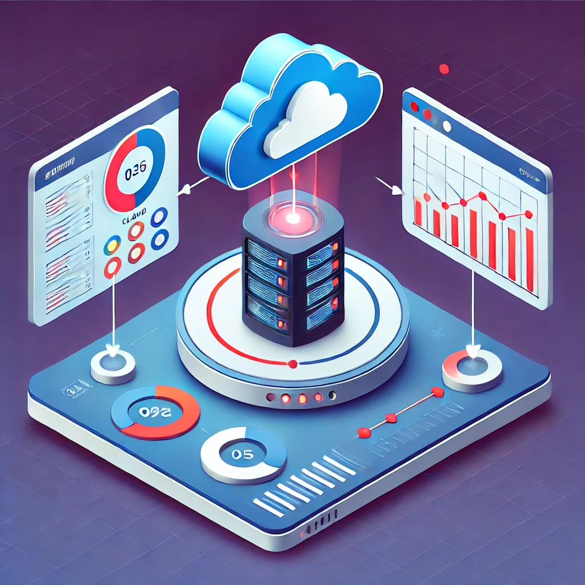
*Generated by DALL-E*

Uma aplicação é devidamente instrumentada quando os desenvolvedores não precisam adicionar mais instrumentos para solucionar um problema, porque eles têm todas as informações de que precisam, ou seja, sem a necessidade de fazer um novo deploy para adicionar mais instrumentos. `Entenda como instrumentos: softwares novos, alterações de arquivos ou configurações, etc.`

Claro, essa maturidade é atingida com o tempo, e é um processo contínuo de melhoria, seria impossível instrumentar tudo de uma vez, pois sempre haverá problemas que não se manifestaram... ainda.

### Três Pilares da Observabilidade
| Pilar    | Descrição                                                                                       |
| -------- | ----------------------------------------------------------------------------------------------- |
| Métricas | Mede quantitivamente, comumente usada para comparar, rastrear desempenho em uma linha do tempo. |
| Logs     | Registro de que um evento ocorreu                                                               |
| Tracing  | Tracing é um mecanismo para acompanhar o fluxo e a progressão dos dados de um software          |

### Conclusão

Aplicações bem instrumentadas são capazes de responder perguntas sobre seu comportamento análisando-as de fora, e isso é o que chamamos de `Observabilidade`.

Instrumentar aplicações é o ato de emitir sinais, esses sinais são divididos em 3 pilares: `traces`, `métricas` e `logs`.

`Telemetria` é o processo de coletar, transmitir e armazenar esses sinais.

---

## <a name="what-are-logs"></a> 1. 📜 Logs: Segredos Escondidos no Código

### <a name="log-introduction"></a> 1.1. Introdução

Todo software executa métodos/funções, essas execuções na maioria das vezes tem algo as nos dizer que fazem valer a pena serem registradas. Então...  
`Logs são registro de eventos que ocorrem no software.`  

Abaixo listo alguns tipos de logs:
- <u>Application Logs</u>
- Audit Logs
- Authorization and Access Logs
- Change Logs
- Event Logs
- Resource Logs
- Server Logs
- System Logs
- Threat Logs
- Transaction Logs

Vamos abordar apenas os logs de aplicação, que são logs gerados por uma aplicação em execução.

**Normalmente em um registro de log de aplicação encontramos:**
- `Timestamp`
- `Mensagem`
- `Nível`
- `Dados de Contexto`

### <a name="log-level"></a> 1.2. Níveis de Logs
- `DEBUG` - Informações detalhadas, normalmente de interesse apenas ao desenvolvedor.
- `INFO` - Captura que eventos ocorreram, mas não são erros.
- `WARN` - Indica que algo inesperado aconteceu, mas o software ainda é capaz de funcionar.
- `ERROR` - Indica que pelo menos um componente do sistema falhou e pode interferir em parte ou no funcionamento geral.
- `FATAL` - Indica que o sistema não pode continuar a funcionar.


### <a name="log-formats"></a> 1.3. Formato de Logs

Abaixo vamos ver algumas estruturas de logs mais encontradas no mercado. O JSON costuma ser o mais utilizado por ser fácil de parsear e por ser estruturado.

#### 1.3.1. Estruturados

<Tabs>
  <TabItem value="json" label="JSON" default>
    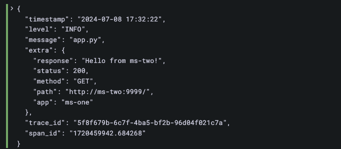

    No exemplo acima perceba que existem dois campos `trace_id` e `span_id`, vamos aborda-los mais a frente.
  </TabItem>
  <TabItem value="xml" label="XML">
    ```xml
    <log>
      <timestamp>2024-07-10T14:45:23Z</timestamp>
      <level>INFO</level>
      <message>User logged in</message>
      <user>john.doe</user>
      <ip>127.0.0.1</ip>
    </log>
    ```
  </TabItem>
  <TabItem value="csv" label="CSV">
    ```csv
    timestamp,level,message,user,ip
    2024-07-10T14:45:23Z,INFO,User logged in,john.doe,127.0.0.1
    ```
  </TabItem>
  <TabItem value="logfmt" label="Logfmt">
    ```txt
    timestamp="2024-07-10T14:45:23Z" level=INFO message="User logged in" user="john.doe" ip="127.0.0.1"
    ```
  </TabItem>
  <TabItem value="syslog" label="Syslog (RFC 5424)">
    ```txt
    <165>1 2003-10-11T22:14:15.003Z mymachine.example.com evntslog - ID47 [exampleSDID@32473 iut="3" eventSource="Application" eventID="1011"][examplePriority@32473 class="high"]
    ```
  </TabItem>
</Tabs>

---

#### 1.3.2. Semi-Estruturados
<Tabs>
  <TabItem value="cef" label="Common Event Format (CEF)">
    ```txt
    CEF:0|Security|ThreatDetection|1.0|100|User logged in|5|msg=User logged in src=127.0.0.1 user=john.doe
    ```
  </TabItem>
  <TabItem value="clf" label="NCSA Common Log Format (CLF)">
    ```txt
    192.168.0.1 - jane [08/Jul/2024:10:23:45 +0000] "POST /login HTTP/1.1" 302 512
    ```
  </TabItem>
</Tabs>

---

#### 1.3.3. Desestruturados

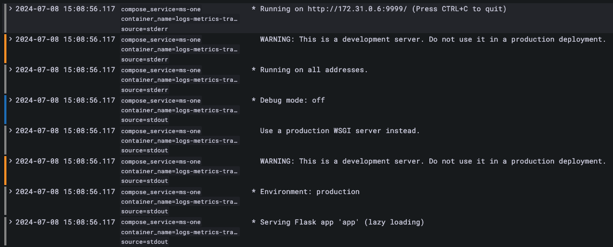

---

Qual a diferença entre `Semi-Estruturado`, `Estruturado` e `Desestruturado`?  

**Semi-Estruturados** possuem uma estrutura fixa, porém os campos não são fixos.  
> *Por exemplo, `Logfmt` tem sempre a mesma estrutura `key=value` com separador de espaço, porém os campos podem variar.*

**Estruturados** possuem uma estrutura fixa e os campos são fixos.  
> *Por exemplo, `JSON` possui sempre os mesmos campos (se assim for implementado), ou seja, todos os logs possuem os mesmos campos, como `timestamp`, `level`, `message` e `extra`, porém os valores podem variar.*

**Desestruturados** não possuem uma estrutura fixa, ou seja, os campos e valores podem variar. 
> *Por exemplo, logs de texto puro.*

### <a name="log-implementation"></a> 1.4. Implementação

Como utilizar logs em uma aplicação? Abaixo vemos um snippet de código da aplicação Flask em Python que construi para exemplificar esse artigo.

```py
@app.route('/')
def hello():
  message = f"Hello from {MS_NAME}!"
  Logger().info('app.py', {"response": message, "status": "200", "method": "GET", "path": "/", "app": MS_NAME})
  
  return message
```

O código está emitindo um log estruturado através da abstração `Logger` para sobrescrever o comportamento padrão do `logging` do Python.

Agora vamos análisar o output em JSON do log gerado por esse código.

```json
{
  "timestamp": "2024-07-05 19:59:37",
  "level": "INFO",
  "message": "app.py",
  "extra": {
    "response": "Hello from ms-one!",
    "status": "200",
    "method": "GET",
    "path": "/",
    "app": "ms-one"
  }
}
```

O destino desse output pode ser um arquivo, um banco de dados, um serviço de log, etc. No nosso caso estamos apenas imprimindo o log no console `stdout` e `stderr`.

### <a name="log-architecture"></a> 1.5. Arquitetura

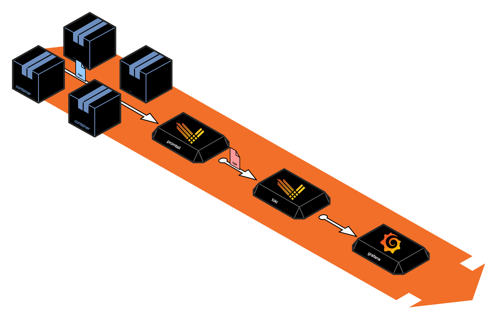

:::info

No exemplo acima o `promtail` é um `agente que coleta logs dos containers` e envia para o `Loki`, que é um `sistema de armazenamento de logs` enquanto o `Grafana` é uma `ferramenta de visualização de logs` que consome diretamente do Loki.

:::

**Armazenar logs acaba se tornando caro 💰 ao longo do tempo**, por isso é importante definir os eventos que realmente possuem valor e padronizar a estrutura de output.  

Busque **pontos estratégicos dentro do código da aplicação para emitir logs com contextos relevantes**, isso vai ajudar a trackear o comportamento do software do lado de fora usando alguma ferramenta de visualização de logs e  permitir que com esses dados sejam montadas dashboards com métricas que irão facilitar a descoberta de problemas e auxiliarão em tomadas de decisões.

### Conclusão

O log estruturado permite que você faça consultas mais complexas de forma mais fácil, e consiga através dos logs construir métricas.  

No log desestruturado o parseamento é mais difícil pois a estrutura não é fixa, e a construção de métricas pode se tornar mais complexa. Pode ocasionar na quebra de dashboards e métricas dependendo de como a consulta foi construída.

:::warning
Não que não seja possível fazer métricas com os logs Semi-Estruturado e Desestruturado, mas acaba se tornando difícil quando não se possui um padrão.
:::

:::tip
**Defina as boas práticas de logging para sua aplicação e siga-as:**
- Defina os níveis de logs que devem ser emitidos em produção, não emita `debug`.
- Defina o formato de output (JSON, XML, CSV...).
  - Defina os campos que devem ser emitidos.
  - Defina quando usar log de erro.
  - Defina quando usar log de info.
  - Defina quando usar log de warning.
  - Defina quando usar log de fatal.
- Projete o código para emitir logs em pontos estratégicos.
- Defina o destino dos logs (stdout, stderr, arquivo, banco de dados, serviço de log, etc)
- Defina a politica de retenção de logs (X dias).
:::

---

## <a name="what-are-metrics"></a> 2. 📈 Métricas: Decifrando o Desempenho do Software

Métricas são valores capturados em seus sistemas em um ponto específico no tempo.  

**Exemplos:**
- o número de usuários que logaram em seus sistema nas últimas 2h
- o número de requisições que sua aplicação recebeu nas últimas 24h
- o tempo médio de resposta de uma requisição dentro das últimas 1h

Podem ser coletadas uma vez por segundo, uma por minuto ou em outro intervalo regular para monitorar um sistema ao longo do tempo. Seus dados são comumente armazenados em um banco de dados de séries temporais, como o InfluxDB, Prometheus, Graphite, etc. No Prometheus a coleta é feita através de `scraping`.

Também construimos métricas através dos logs de aplicação, filtrando e agregando os dados dentro de um intervalo de tempo. Chamamos essa técnica de [White-box monitoring](https://sre.google/sre-book/monitoring-distributed-systems/).

Por Exemplo, a partir dos logs da aplicação que possuem o campo `extra_path="/health"`, podemos contar quantas vezes a rota `/health` foi requisitada em um intervalo de tempo. Veja abaixo:

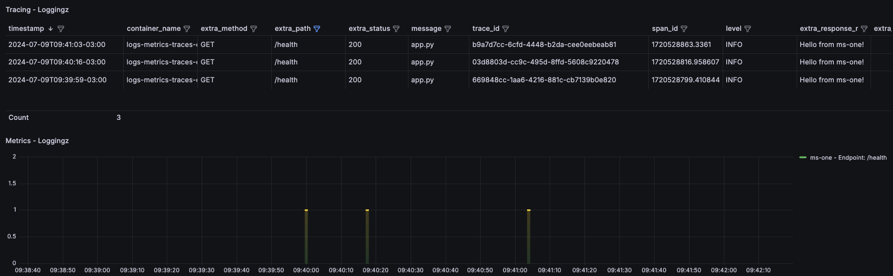

Foram feitos 3 requests para a rota `/health` em um intervalo de `~1 minutos`. Neste caso construimos uma métrica de `Tráfego` (Traffic).

### 2.1. Métricas de Recursos (CPU, Memória, Disco, Rede)

Métricas de recursos são métricas que medem o uso de recursos de um sistema, como CPU, memória, disco e rede. Essas métricas são essenciais para monitorar a saúde e o desempenho de um sistema e identificar gargalos e problemas de desempenho.

| Sinal       | Descrição                                                                             |
| ----------- | ------------------------------------------------------------------------------------- |
| Utilization | Mede a quantidade de recurso que está sendo usada.                                    |
| Saturation  | Mede o grau em que um recurso está perto de sua capacidade máxima ou além.            |
| Errors      | Mede a quantidade de erros que ocorreram ao usar um recurso.                          |
| Jitter      | Mede a variação que o pacote na rede é transmitido e quando ele é recebido.           |
| Capacity    | Mede a quantidade máxima de trabalho que um sistema pode realizar. Ex: 8GB RAM, 3vCPU |

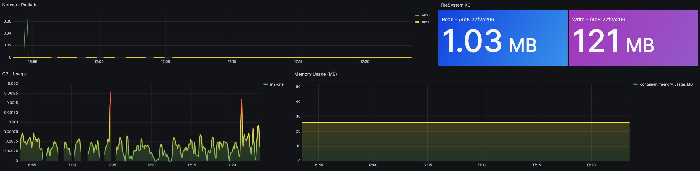

### 2.2. Métricas de Serviço (Four Golden Signals)

Apresentadas no livro SRE do Google, essas 4 métricas são destinadas a entender a experiência de uso do sistema do ponto de vista dos usuários - Service-Oriented.

| Sinal      | Descrição                                                                   |
| ---------- | --------------------------------------------------------------------------- |
| Latency    | Mede o tempo que o sistema leva para responder a uma solicitação.           |
| Traffic    | Mede o número de requisições que o sistema está recebendo.                  |
| Errors     | Mede o número de erros que o sistema está retornando.                       |
| Saturation | Mede o grau no qual um recurso está perto da sua capacidade máxima ou além. |

A métrica de desempenho mais comum é a latência, que representa o tempo necessário para concluir uma unidade de trabalho. **A latência pode ser expressa como uma média ou como um percentil, como "99% das solicitações retornaram em 0,1s".**  

:::tip
A média é muito usada para entender o desempenho geral de um sistema, porém a média não é um valor tão confiável, pois pode ser distorcida por valores extremos, já os percentis são úteis para entender o desempenho em diferentes quantis da distribuição.
:::

Abaixo mostro uma dashboard para monitorar o uso total de CPU de um Container. Fiz uma simulação de 1000 requests e podemos ver o pico de CPU.

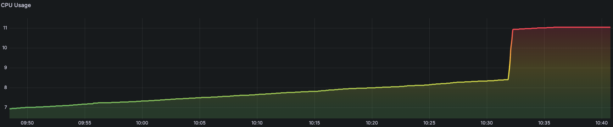

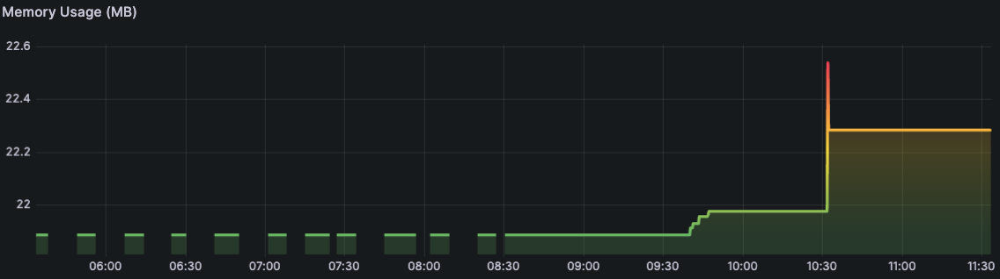


### 2.2. Algumas Boas Práticas

- **Fácil de Entender** Deve ser possivel determinar rapidamente o que cada métrica ou evento representa.

- **Custo** Armazenar métricas pode ser caro, então você deve coletar apenas o que é realmente necessário.

- **Granular** Se você coletar métricas muito agregadas, você pode perder informações importantes. Por exemplo, se você coletar a média de latência de uma solicitação, você pode perder informações sobre picos de latência que podem ser importantes para a experiência do usuário. Se você coletar métricas muito granulares, você pode acabar com muitos dados que são difíceis de analisar. Encontre um equilíbrio entre a granularidade e a agregação que funcione para você.

- **Etiqueta de Escopo** Cada um dos seus hosts opera simultaneamente em vários escopos, e você pode querer verificar a saúde de qualquer um desses escopos, ou suas combinações. Por exemplo: como está a métrica X total? E a métrica X no Nordeste dos EUA?.

- **Vida útil** Mantenha uma política de retenção de dados que permita que você investigue problemas passados e identifique tendências ao longo do tempo.

### 2.3. Arquitetura

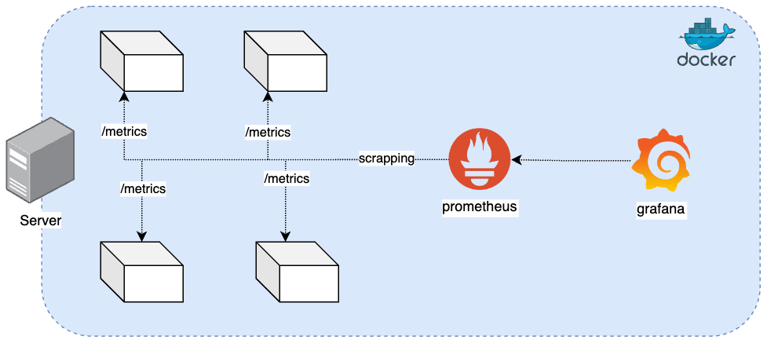

### Conclusão

As métricas conseguem informar o estado passado e presente do sistema, e ajudam a prever comportamentos que podem ocorrer no futuro.  

Respondem qual parte do software está sendo mais acessada, qual parte está consumindo mais recursos, qual parte está mais lenta...

Não se resumem a apenas métricas de recurso, mas também a métricas de negócio, como o número de vendas, o número de usuários ativos...  

Mas lembre-se, métricas são apenas números, e para entender o que esses números significam, você precisa de logs.

---

## <a name="what-is-tracing"></a> 3. 👣 Tracing: Rastreando Segredos

O objetivo principal do tracing é fornecer visibilidade detalhada sobre como o processamento daquela chamada foi feito, e como ela se relaciona com outras chamadas. 

Quando essa requisição se extende para fora da aplicação, o tracing se torna distribuído, chamamos-o de [Distributed Tracing](#31-distributed-tracing).

Uma aplicação CLI por exemplo, pode ser instrumentada para gerar traces.

Isso é feito registrando cada operação ou evento importante durante o ciclo de vida de uma requisição.

Um dos principais componentes do tracing é o conceito de `span`. 

```txt
TRACE
  |-- SPAN
  |     |-- LOG
  |     |-- LOG
  |     |-- LOG
  |-- SPAN
  |     |-- LOG
  |     |-- LOG
```

Note que um `span` pode conter vários `logs`.

Um span representa uma unidade de trabalho ou operação e contém informações como:

- Nome da operação
- Início e fim da operação (timestamps)
- Metadados ou atributos adicionais (como IDs de usuário, tipos de operações, etc.)
- Relacionamento com outros spans (pai-filho)
- Logs associados à operação

Os spans podem ser organizados em uma hierarquia que reflete a estrutura da execução da requisição, facilitando a visualização de como uma requisição é processada de ponta a ponta dentro de uma aplicação.

#### Exemplo

Abaixo mostro o output de uma classe python que criei que gera logs estruturados. Nela é possível ver dois `spans` que foram gerados para o mesmo `trace_id`.

Porém ela é básica, ou seja, não possui o conceito de que um `span` possui `1..N logs`. Vemos que `1 span` possui `1 log`.

Perceba que o `trace_id` é o mesmo para os dois `spans`, isso indica que ambos os `spans` fazem parte da **mesma requisição**.

Essa requisição está executando 2 métodos diferentes da aplicação, e ambos os métodos estão gerando logs.

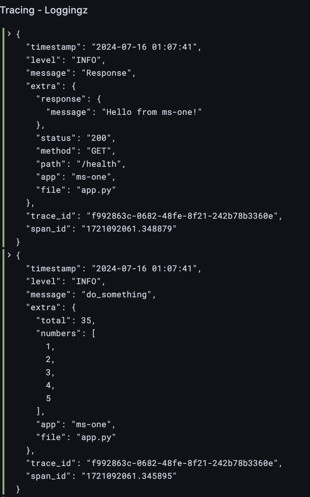

### 3.1. Distributed Tracing


O distributed tracing (rastreamento distribuído) se expande para ambientes onde múltiplas aplicações e serviços colaboram para processar uma requisição. 

Em um sistema distribuído, uma única requisição pode atravessar várias aplicações e serviços, cada um deles contribuindo com uma parte do processamento.

O distributed tracing tem como objetivo fornecer visibilidade ponta a ponta de como as requisições fluem através de um sistema distribuído, identificando pontos de latência, gargalos e falhas.

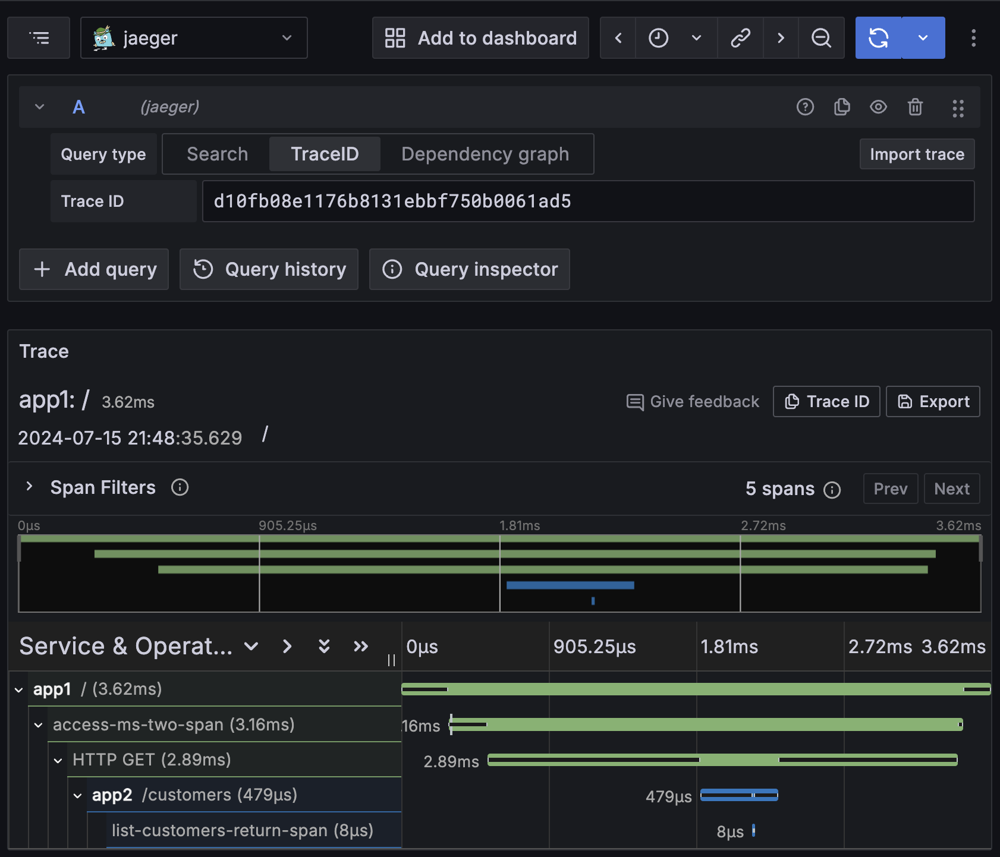

### Conclusão

O tracing é uma ferramenta poderosa para entender como as requisições são processadas em uma aplicação e como elas se relacionam com outras requisições.

O tracing é especialmente útil em sistemas distribuídos, onde várias aplicações e serviços colaboram para processar uma requisição. 

Mas também é muito útil em sistemas onde uma requisição pode ser processada por várias partes da aplicação.

---

## <a name="what-is-monitoring"></a> 4. 🚨 Monitoramento: Desvendando Mistérios em Tempo Real

Monitoramento é o ato de ativamente observar o estado de um sistema para detectar problemas e tomar medidas corretivas.

O monitoramento é uma parte essencial da observabilidade, pois fornece informações em tempo real sobre o estado de um sistema e ajudam a identificar que está ocorrendo problemas.

Usamos alertas para notificar os operadores do sistema quando alguma politica de alerta é violada. Esses alertas ajudam a manter os operadores do sistema cientes sobre o que está acontecendo.

Exitem duas abordagens de Monitoramento, chamamos de Ativo e Passivo

| Aspecto                   | Monitoramento Ativo                                           | Monitoramento Passivo                                       |
| ------------------------- | ------------------------------------------------------------- | ----------------------------------------------------------- |
| **Método**                | Envia requisições/sondas ao sistema                           | Observa o tráfego de rede e coleta logs                     |
| **Proatividade**          | Proativo                                                      | Reativo                                                     |
| **Sobrecarga**            | Pode adicionar carga adicional ao sistema                     | Baixa sobrecarga                                            |
| **Detecção de Problemas** | Detecta problemas rapidamente através de sondagens constantes | Pode detectar problemas após eles terem ocorrido            |
| **Vantagens**             | Detecção rápida, ação preventiva, métricas detalhadas         | Baixa sobrecarga, informações detalhadas, análise histórica |
| **Desvantagens**          | Sobrecarga de rede, possíveis falsos positivos                | Reatividade, dependência de qualidade de logs               |

A prática do monitoramento ativo é comum em sistemas críticos, onde a detecção de problemas e ação preventiva são essenciais para garantir a disponibilidade e confiabilidade do sistema. 

Pense que você fica cutucando o sistema para ver se ele está responsivo e funcionando como deveria.

Já a prática do monitoramento passivo é comum para todos os sistemas.

### Conclusão

Para monitorar um sistema de forma eficaz, defina métricas e thresholds para que quando um threshold for violado, um alerta seja disparado e o operador do sistema receba notificação.

Mas tome cuidado com o excesso de alertas, pois isso pode levar a fadiga de alertas e fazer com que os operadores ignorem alertas importantes.

---

## Referências
- https://www.oreilly.com/library/view/observability-engineering/9781492076438/
- https://www.manning.com/books/software-telemetry
- https://sre.google/sre-book/table-of-contents/ (Free to Read Online)